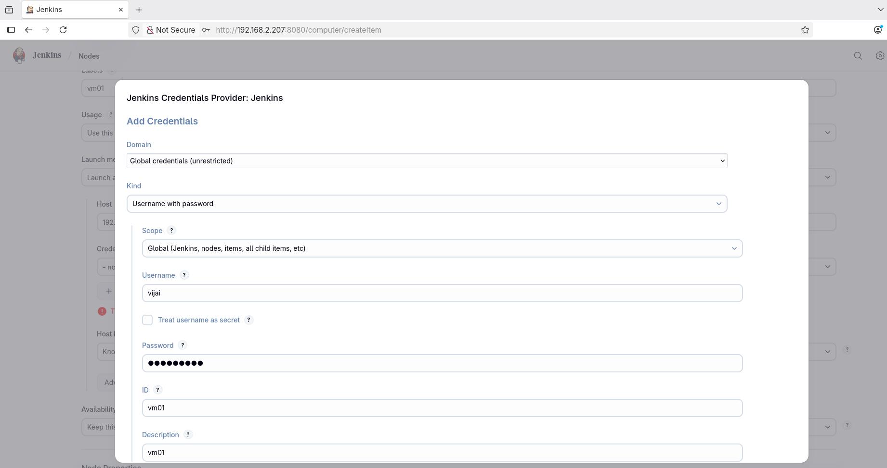

# linux-ubuntu-jenkins-ci
Quick jenkins Master and Agent setup guide for building CI pipeline


Technical stack 

* Ubuntu server
* Java 17 or 21 as per July 2025

#### Step1:  system update
```
sudo apt-get update -y
```


#### Step2: Install Java17
```
sudo apt-get install openjdk-17-jdk -y
```


#### Step3: Install Jenkins from Official 

```
curl -fsSL https://pkg.jenkins.io/debian-stable/jenkins.io-2023.key | sudo tee /usr/share/keyrings/jenkins-keyring.asc > /dev/null
```

```
echo deb [signed-by=/usr/share/keyrings/jenkins-keyring.asc] https://pkg.jenkins.io/debian-stable binary/ | sudo tee /etc/apt/sources.list.d/jenkins.list > /dev/null
```
```
sudo apt-get update -y
```

```
sudo apt-get install jenkins -y
```


#### Step4: For some reason if it fails. Check the error using this.

```
sudo -u jenkins /usr/bin/jenkins
```
#### Step5: Check Jenkins is running or not and start if not.

```
sudo systemctl status jenkins
sudo systemctl daemon-reload

sudo systemctl restart jenkins
sudo systemctl status jenkins
```

#### Step6: Check it is running without error.

```
sudo systemctl status jenkins
```


#### Step 7: Access the Jenkins to work with it.

```
http://server-ip-address:8080
```


#### Step 8:
Incase remove the current setup.

```
sudo systemctl stop jenkins
sudo apt remove jenkins -y 
sudo rm -rf /var/lib/jenkins/
```
#### (optional) 
If u installed older version of java like to switch to this Java 17 version follow this.

```
sudo update-alternatives --install /usr/bin/java java /usr/lib/jvm/java-17-openjdk-amd64/bin/java 1

sudo update-alternatives --config java

java -version
```

#### (optional) 
Make sure Jenkins points to the latest installed Java. 
```
sudo systemctl edit jenkins

[Service] 
Environment="JAVA_HOME=/usr/lib/jvm/java-17-openjdk-amd64"
```

and default points to the latest installed Java.


That's all. Start building with Jenkins!:-)

#### Important: Start installing Git, Go and other application plugins on the Jenkins master node as well on the agent later on as it is required for running Build Job processing.


#### Add VM agent to Jenkins master node


After configured your Jenkins master, Login into the Jenkins master again.

```
http://jenkins-master:8080
```


select "Set up an agent"


Give new node name and type as Permanent agent and then go for create.


Configure the jenkins agent as shown below. 


Make sure to add the SSH credentials under credentials Jenkins provider.


Make sure the tool are enabled for the Jenkins agent to process build jobs.


Jenkins credentials Provider: Jenkins 



Once added, Just make sure Host key vertification strategy is set to Known hosts file verification strategy. 
Which means you should have already ssh from the Jenkins master to Jenkins VM01 agent. So, the Vm01 host details would be auto-added into the Jenkins master server known hosts list.


Once save and added check for status update.


Jenkins master is now connected with Jenkins Vm01 agent via ssh


Status and specific check of Vm01 Jenkins agent.


#### Preparing Jenkins Agent to handle different application job processing

```
```

#### Verification 

```
go version
which go 
```

# Configure Jenkins Agent tools for Nodejs application building projects

```
su - 
apt-get update && apt-get upgrade -y
```

### Add jenkins user to sudoers 

```
usermod -aG sudo jenkins
```

```
su - jenkins
sudo apt-get update && sudo apt upgrade -y
```

```
curl -fsSL https://deb.nodesource.com/setup_18.x | sudo -E bash - 
sudo apt install nodejs -y 
sudo apt install npm -y
```

```
node --version
npm --version
```

#### Make sure nodejs plugin is enabled on the Jenkins master -> Manage jenkins 


and this will install the Nodejs and will restart the Jenkins master.


and make sure, under Manage Jenkins > Tools > NodeJS installations 

NodeJS-18 is configured with "Install automatically" enabled and version "NodeJS 18.0.0" is selected and saved. So, the Jenkins master is aware of the nodejs version you're dealing with the application build process and will make sure it is installed on the VM agent.


